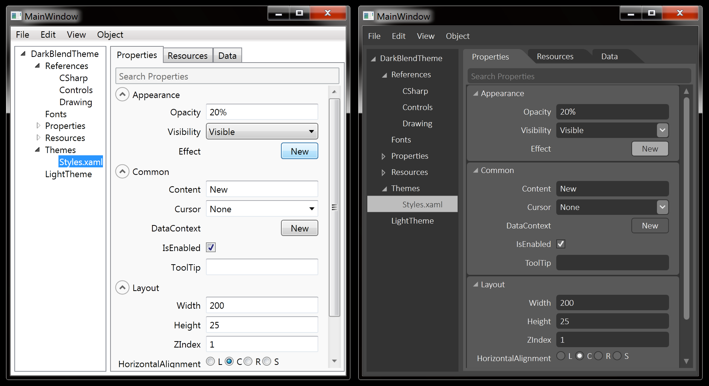

#Dark Blend theme for WPF 

### A WPF theme which will make an application look like Blend.


Before / After
####List of supported controls
- Button
- CheckBox
- ComboBox
- Expander
- Label
- ListView
- RadioButton
- ScrollViewer
- TabControl
- TextBox
- ToggleButton

####How to use that theme in your application

1. Download the project. 
2. Copy Themes folder with Styles.xaml file to your project. 
In order to use that theme you need just to add a reference to Styles.xaml into the App.xaml file.
So, open App.xaml and add following code:

```
<Application
	...
	<Application.Resources>
		<ResourceDictionary>
           	<ResourceDictionary.MergedDictionaries>
				<ResourceDictionary Source="Themes\Styles.xaml” />
			</ResourceDictionary.MergedDictionaries>
		</ResourceDictionary>
	</Application.Resources>
</Application>
```

If you want to apply the theme to the control which is derived from Window (for example MainWindow) you must add to corresponding xaml a style definition like following.

```
<Window ... Style="{StaticResource {x:Type Window}}”>
```
That's all.

###Todo

- Nuget version will be available soon.
- Some standard controls are missed, but don't worry, I'm working on them now.


###Feedback

I hope you find it useful. Feel free to contact me for any questions you may have.
[](http://githalytics.com/DanPristupov/WpfThemes)
